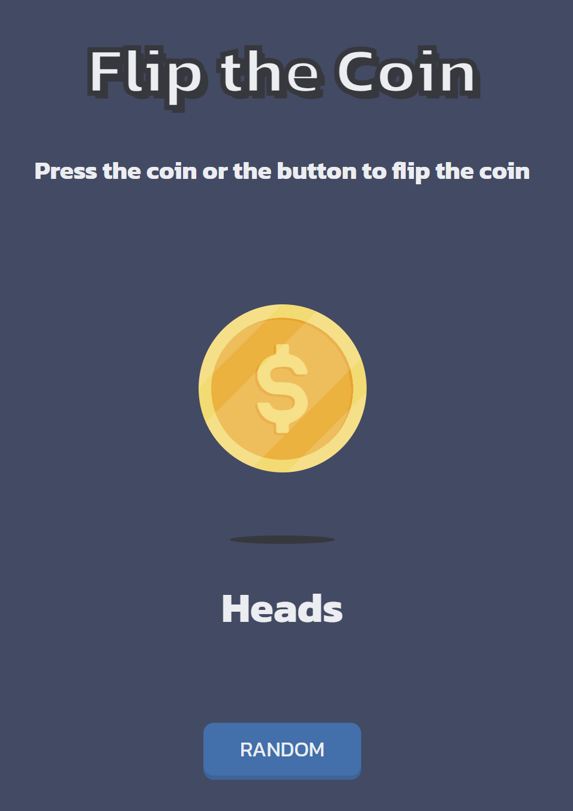

<h1 align="center">Flip The Coin | DevChallenges</h1>

   Solution for a challenge <a href="https://devchallenges.io/challenge/flip-the-coin" target="_blank">Flip The Coin</a> from <a href="http://devchallenges.io" target="_blank">devChallenges.io</a>.

  <h3>
    <a href="https://flip-the-coin-dev-challenges.vercel.app/">
      Demo
    </a>
     | 
    <a href="https://github.com/therealgone/Flip-The-Coin-Dev-challenges">
      Solution
    </a>
     | 
    <a href="https://devchallenges.io/challenge/flip-the-coin">
      Challenge
    </a>
  </h3>

<!-- TABLE OF CONTENTS -->

## Table of Contents

- [Overview](#overview)
  - [What I learned](#what-i-learned)
  - [Useful resources](#useful-resources)
- [Built with](#built-with)
- [Features](#features)
- [Contact](#contact)
- [Acknowledgements](#acknowledgements)

<!-- OVERVIEW -->

## Overview

Flip The Coin is a fun and interactive coin-flipping game built using **HTML, CSS, and JavaScript**. This project helps practice web development skills by combining structured HTML, styled animations, and JavaScript interactivity.

### What I learned

- Creating smooth **CSS animations** for a realistic coin flip effect.
- Handling **DOM manipulation** efficiently with JavaScript.
- Implementing **event listeners** for user interactions.
- Using **Git & GitHub** for version control and collaboration.
- Deploying static sites on **Vercel**.

### Useful resources

- 📖 [CSS Animations Guide](https://developer.mozilla.org/en-US/docs/Web/CSS/CSS_Animations/Using_CSS_animations)
- 📖 [JavaScript DOM Manipulation](https://developer.mozilla.org/en-US/docs/Web/API/Document_Object_Model/Introduction)
- 📖 [Vercel Deployment Docs](https://vercel.com/docs)

### Built with

- **Semantic HTML5** for structured content.
- **CSS Custom Properties** for maintainable styling.
- **Flexbox & CSS Animations** for responsive design.
- **Vanilla JavaScript** for logic and interactions.

## Features

✅ Click the button or coin to flip it.  
✅ Animated spinning effect with smooth transitions.  
✅ Displays the result (Heads/Tails) dynamically.  
✅ Responsive design that works on all screen sizes.  

## Acknowledgements

This project was created as a submission to a [DevChallenges](https://devchallenges.io/challenges-dashboard) challenge.

## Author

- Website: [Flip The Coin](https://flip-the-coin-dev-challenges.vercel.app/)
- GitHub: [@therealgone](https://github.com/therealgone)

---

💡 **Feel free to contribute! Open issues or pull requests to improve this project.** 🚀
